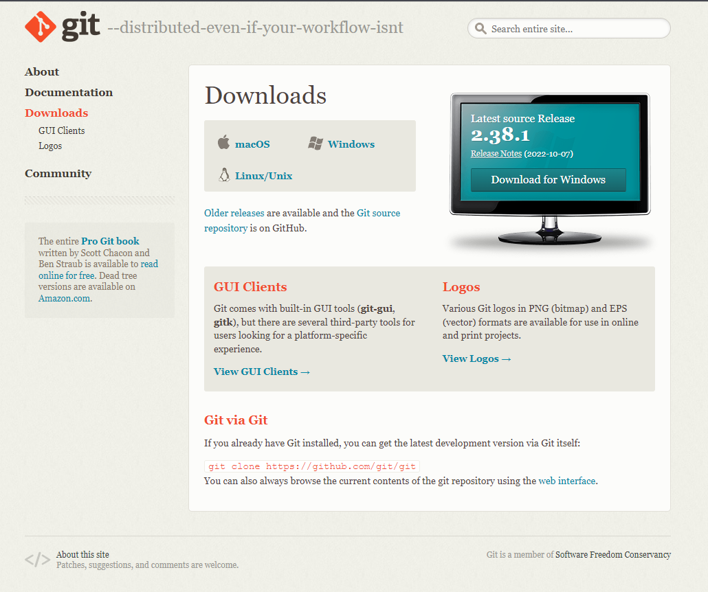
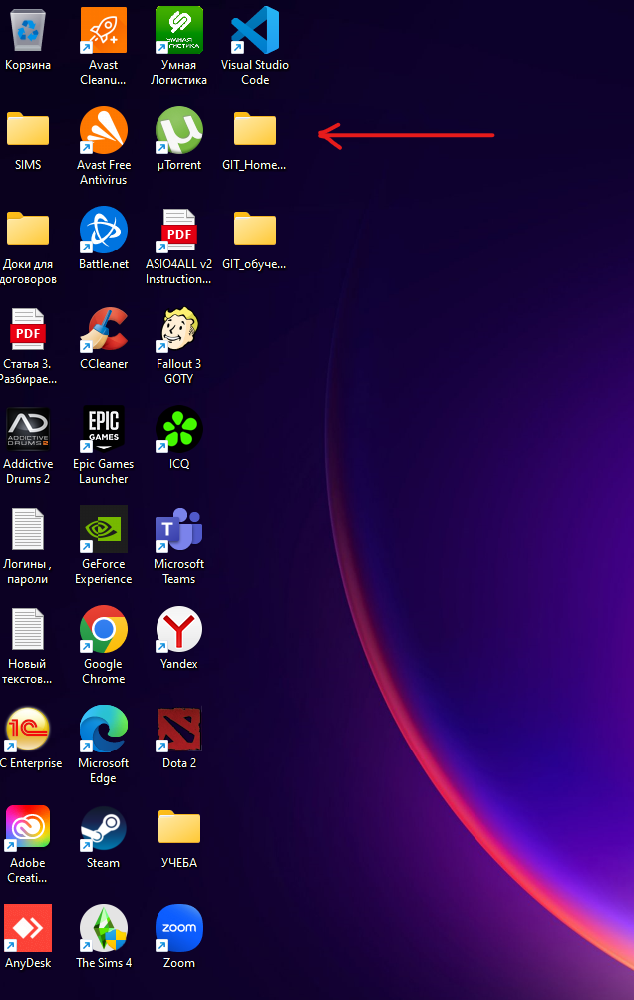
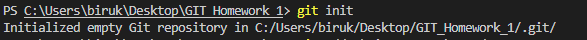
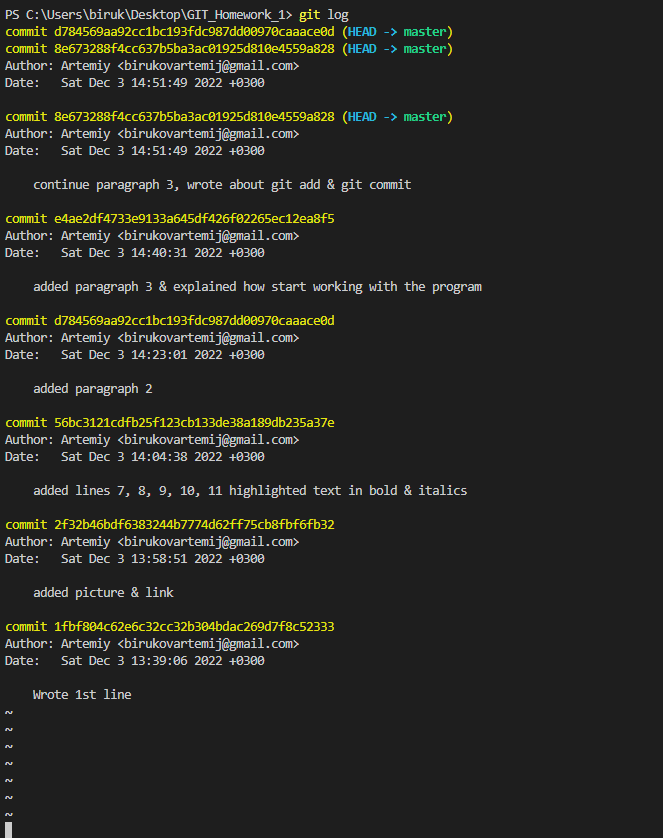
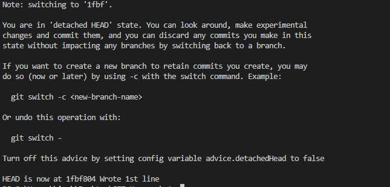
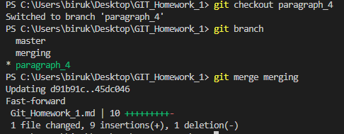
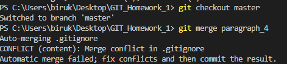

# Инструкция по использованию GIT
## 1. Для начала необходимо установить GIT на Ваш компьютер.
Для этого необходимо перейти по этой ссылке https://git-scm.com/downloads
В открывшемся окне сайта выбираем какую версию программы скачать, в зависимости от Вашей ОС.

Нажимаем на выбранную версию программы, скачиваем и запускаем файл.
Далее выполняем установку. **Внимание!** *В появившихся диалоговых окнах нажимаем кнопку next в раскрывающихся списках ничего не меняем. Все установится автоматически*

В результате этой процедуры на Вашем компьютере будет установлено ПО GIT.

## 2. Настраиваем GIT.

Для начала нам необходимо запустить терминал GIT BASH 
У нас откроется окно терминала GIT в котором нам необходимо будет представиться программе. Для этого последовательнно вводим две команды в консоли:

* git config --global user.name "Ваше имя английскими буквами"
* git config --global user.email "Ваша электронная почта"

Эти данные будут указываться, когда вы будете делать коммиты, а указание реальных данных упростит командную работу.

***Все это необходимо для того чтобы во время командной работы над проектом всем могли видеть кто и когда вносил изменения в проект.***

## 3. Работа с GIT.
Теперь когда программа установлена и настроена мы можем начать нашу работу с системой контроля версий. 

Для начала создадим на нашем компьютере папку, в которой мы будем вести работу. У меня она называется GIT_HOMEWORK_1 и располагается на рабочем столе.

Далее открываем программу в которой мы пишем код (у меня это Visual Studio Code) и ~~творим магию~~ через проводник создаем файл в этой папке с необходимым нам расширением. В моем случае это расширение *.md*.

Теперь необходимо добавить эту папку к отслеживанию в систему контроля версий GIT.

Для этого в нашей программе открываем терминал и в консоли прописываем команду git init. Если все сделали правильно, то увидим сообщение что в указанной папке создан репозиторий.

Это означает что теперь все изменения в нашей папке отслеживаются программой GIT и мы можем эффективно использовать систему контроля версий.

В дальнейшем когда мы вносим изменения в наш файл (например добавляем новые строки, слова, фразы, картинки и тд.), мы можем сохранять эти измения и в любой момент возвращаться к разным версиям файла.

Для того что бы сохранить изменения и добавить в GIT новую версию файла необходимо:

1. Сохранить файл при помощи комбинации клавиш CTRL+S, либо через кнопку в верхней части окна "Файл" -> Сохранить.
2. Добавить сохраненный файл в GIT при помощи команды в терминале *git add "название файла"*
3. Добавить в GIT комментарий по изменениям в текущей версии файла при помощи команды *git commit -m "Ваш комментарий"*

**ВАЖНО** Для корректного сохранения версий необходимо выполнять действия именно в том порядке в котором они описаны выше. В противном случае система не сможет работать корректно.

Для просмотра сохраненных версий файла и чтения комментариев к ним воспользуемся командой *git log*. Эта команда покажет журнал всех изменений со всеми комментариями и датой и временем внесения изменений. Так же там мы увидим кто вносил изменения (именно для этого мы и представлялись программе в п.2)

На скриншоте видны  все версии моего файла.

Если мы хотим перейти к одной из версий нашего файла необходимо в терминале прописать команду *git checkout "название версии"*

В названии версии (коммита) достаточно использовать первые 4 символа. После этого мы переключимся на указанную версию файла и в терминале увидим сообщение как на скриншоте ниже.

Здесь я вернулся к самой первой версии моего файла.

При помощи команды git checkout master я снова вернулся к последней версии моего файла.

Таким образом при помощи программы GIT можно вести эффективую работу над проектом и в любой момент вносить и сохранять правки в различных версиях проекта.

## 4. Создание веток и работа с ними.

Ветки при работе с GIT необходимы для того что бы каждый участник проекта мог работать со своей частью не оказывая влияние на весь проект в целом. Можно назвать это "черновиками", в которые мы вносим изменения перед тем как добавить их в основной файл проекта.

Первоначально, при создании нового проекта у нас есть только одна ветка, как правило она называется master, именно она и является нашим "чистовиком".

Но, благодаря системе GIT мы можем создавать отдельные ветки, в которых будем работать над какой-либо частью проекта. Например, сейчас я создам такую ветку в этом файле, назовем ее "paragraph_4".

На приложенном мной скриншоте мы можем увидеть процесс создания ветки:

1. В терминале я вызвал команду "git branch" для того что бы посмотреть список существующих веток. Обратите внимание что в этот момент существовала только одна основная ветка "master". Звездочкой (*) и зеленым цветом была выделена та ветка на которой я находился.
2. Далее я использовал команду "git branch new_branch_name" для того что бы создать дополнительную ветку.
3. Я снова вызвал команду "git branch" для того что бы проверить появилась ли новая ветка в списке, как видите она появилась.
4. Использовал команду "git checkout branch_name" для того что бы переключиться на интересующую меня ветку.
5. Снова использовал команду "git branch" для того что бы проверить на какой ветке я нахожусь. Как видите теперь знаком звездочки (*) и зеленым цветом выделяется другое название ветки.

Обратите внимание на это скриншот. Здесь я снова вернулся к ветке "master" и как вы можете заметить после 77й строчки нет ни предыдущего скриншота ни описанного мной выше порядка действий. Это наглядный пример того что пока я работаю в одной побочных веток, в основной ничего не меняется.

## 5. Слияние веток.

Итак, мы провели работу в побочной ветке, теперь нам необходимо быстро перенести информацию из этой ветки в основную.

Для этого нам необходимо ввести команду "git merge branch_name". **ВАЖНО!** Ветка которую мы сливаем переходит в ту ветку в которой мы находимся во время слияние.

*__Например.__* Я создал еще одну ветку и назвал ее "merging" в ней я сейчас 5й пункт этой инструкции. Если я переключусь на ветку "paragraph_4", то я не увижу там пункта 5. Точно так же, если я переключусь на ветку "master", то не увижу там ни пункта 5 ни пункта 4. Теперь проведем слияние веток "paragraph_4" и "merging".

Итак, я переключился на ветку "paragraph_4" и находясь в ней ввел команду "git merge merging". Как мы видим на скриншоте, слияние прошло успешно, никаких ошибок не появилось. GIT сообщил сколько строчек было слито и файлов изменено.

При этом, в основной ветке "master" по прежнему пока нет никаких изменений. Проведу слияние с основной веткой тем же способом.

Как видите у меня произошел **конфликт** при слиянии веток. В этом конкретном случае проблема была не в тексте самого файла, а в файле ".gitignore", который я создавал для того что бы добавить туда файлы, которые системе контроля версий не нужно отслеживать.

Во время работы над одним из пунктов я добавил новый файл в список .gitignore и забыл что сделал это в побочной ветке. При слиянии с основной веткой и произошел конфликт. К сожалению я не успел его заскринить. Поэтому создадим еще один конфликт чтобы показать наглядно как это выглядит и как это решить.

Итак, здесь я напишу другой текст в те же строки что и в ветке "conflict".

В качестве альтернативного текста я выбрал цитату из песни группы Ляпис Трубецкой - В платье белом. Сегодня я пол дня пытался вспомнить в каком платье в песне приходит любовь весной.

>Любовь зимой приходит в платье белом

>Весной любовь приходит в платье голубом

>Любовь приходит летом в платьице зеленом

>А осенью любовь приходит в платье голубом

Ну повеселились и хватит, теперь проведем слияние.